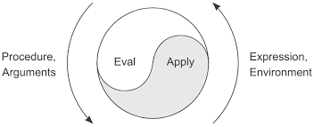

# meta-org

_An organization is a program that writes itself._

---

**meta-org** is a metacircular substrate for programmable organizations, written in Guile Scheme. It asks a simple question: what if an organization were a Lisp environment — and the people in it were expressions that could rewrite the interpreter?

The system is deliberately minimal. It provides identity, memory, and a mechanism for self-modification. What it _becomes_ is not prescribed. A meta-org could evolve into a democracy, a marketplace, a neural network of agents, a single autocratic expressor, or something with no existing name. The structure doesn't impose direction — it makes direction _expressible_.

## Metacircularity

The deepest idea here is borrowed from the metacircular evaluator tradition: a Lisp that interprets Lisp, defined in terms of itself.

meta-org extends this reflexivity to organizations:

- **The evaluator is written in Scheme, and evaluates Scheme.** The language that defines the organization is the same language the organization operates in.
- **Validators validate themselves.** When you `enact!` a new validator, it must accept its own installation. The rules for changing the rules are subject to the current rules.
- **Expressors can create expressors.** Identities within the system can bring new identities into being.
- **History records the expressions that produced it.** The system's past is stored as evaluable code — the organization can replay, inspect, and reason about its own evolution.

This means there is no privileged outside. The system is defined from within, modified from within, and understood from within. Like a metacircular evaluator, the boundary between the thing and its description dissolves.

## Core Concepts

### Expressors

An expressor is an identity — a _who_ attached to every action. It carries a name, a public key, and a unique symbol. There is no anonymous mutation; every change to the environment names the expressor that caused it.

```scheme
(defexpressor 'alice "alice-public-key")
```

An expressor is not necessarily a person. It could be a process, an external system, a role, or another meta-org. The system does not distinguish — it only requires that expression has a source.

### Environments

An environment is an immutable snapshot:

| Component     | Role                                              |
| ------------- | ------------------------------------------------- |
| **Bindings**  | The current namespace — what the org _knows_      |
| **Validator** | A function gating every change — how it _decides_ |
| **History**   | A versioned ledger — what it _remembers_          |
| **Expressor** | The identity currently acting — who _speaks_      |

Each operation returns a new environment. The previous state is not destroyed — it becomes history.

### Validators

A validator is an ordinary function: `(expressor name value old-env new-env) -> bool`. It validates both past (old-env) and post-validation (new-env) states, allowing it to inspect the full timeline before and after the change. It returns true or false.

The default validator accepts everything. You replace it with `enact!`. The metacircular constraint: **a new validator must accept itself** before it takes effect. This means the mechanism for changing the rules is always subject to the current rules — but _what_ those rules are is entirely open.

### History

Every change produces a history entry: a version number, the expressor, the expression evaluated, and a pointer to its parent. The ledger is append-only. Because entries store the original expressions as data, the organization's past is not merely recorded — it is **replayable**.

## Usage

### Initialize

```scheme
(use-modules (metaorg play))

(define env (make-initial-env '((x . 0) (y . 1))))
```

### Modify

```scheme
;; Bind a value — attributed, validated, versioned
(evaluate '(modify! 'x 42) env)
```

### Act as another expressor

```scheme
(evaluate '(as alice (modify! 'x 99)) env)
```

### Change the rules

```scheme
;; Install a validator — it must accept itself to take effect
(evaluate '(enact! (lambda (expressor name value old-env new-env)
                     (number? value)))
          env)
```

### Inspect

```scheme
(evaluate '(show-history) env)
(evaluate '(show-expressors) env)
```

### Rollback

```scheme
;; Revert to version 2 — replays history with original expressors
(evaluate '(rollback! 2) env)
```

Rollback does not erase — it replays. Each step is re-evaluated under the identity that originally performed it, so attribution survives time travel.

## The Evaluator

`evaluate` is a small Lisp interpreter. It understands:

| Form                         | Effect                                   |
| ---------------------------- | ---------------------------------------- |
| `#t`, `#f`, numbers, strings | Self-evaluating literals                 |
| `(quote x)`                  | Returns `x` unevaluated                  |
| `(if test then else)`        | Conditional                              |
| `(lambda (args ...) body)`   | Closure — captures the current expressor |
| `(defexpressor name key)`    | Bring a new identity into being          |
| `(as expressor expr)`        | Evaluate under a different identity      |
| `(modify! name value)`       | Bind a value in the environment          |
| `(enact! validator-expr)`    | Replace the validator                    |
| `(rollback! version)`        | Replay to a prior state                  |
| `(show-history)`             | Print the versioned history              |
| `(show-expressors)`          | Print all known identities               |
| `(f args ...)`               | Function application                     |

Lambdas close over the expressor that created them. A function acts with the identity of its author, not its caller — authorship persists through application.



## What this is not

This is not a governance framework. It does not encode voting, consensus, hierarchy, or any particular organizational form. It is the layer _beneath_ those — a substrate in which any such form could be expressed, enacted, and later replaced by something else entirely.

The only invariants are: every action has an identity, every change is remembered, and the rules for changing the rules are themselves subject to the rules.

What emerges from that is up to the expressors.
